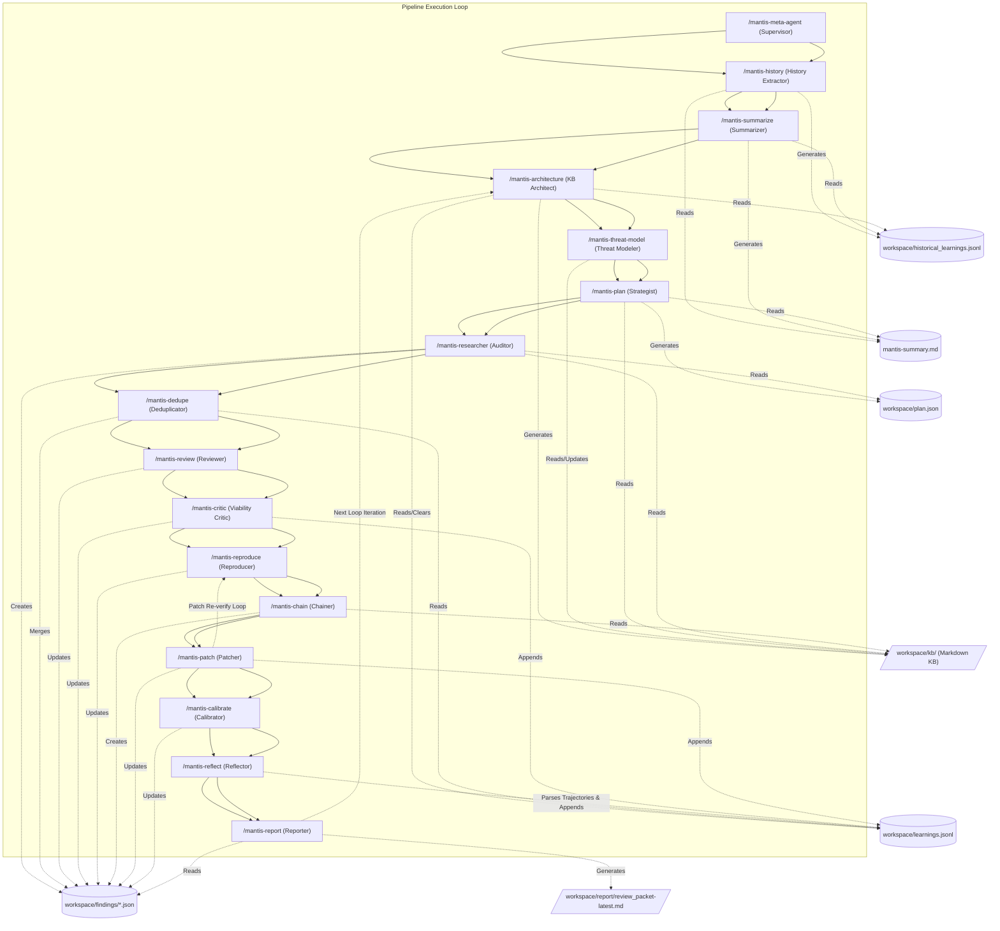

# Mantis Skills: Reference Guide for AI Agents

This document is the canonical reference guide for AI Agents operating in this
workspace. It describes the Mantis pipeline architecture, the individual skills
(stages), the inter-stage data contracts, and the design patterns required to
run and extend the pipeline.

As an agent, you must adhere to the contracts, file paths, and execution
patterns defined in this document.

______________________________________________________________________

## Adaptability & Specialized Domains

While the default skills look for generic RTL design bugs (clock-domain crossing
hazards, reset issues, FSM defects, X-propagation, unintended latches, register
access-control flaws, arithmetic/width bugs, and hardware-security weaknesses) in
typical SoC and IP designs, they can be adapted for:

- **SoC Integration Reviews**: Auditing bus fabrics (AXI, AHB, APB, Wishbone,
  TileLink), interconnect, and inter-IP trust boundaries for protocol and
  isolation bugs.
- **Security IP Reviews**: Auditing key managers, crypto blocks, secure-boot
  ROMs, fuse/OTP and lock-bit logic, and memory-protection/IOMMU blocks for
  access-control and isolation weaknesses (see MITRE's Hardware Design CWE view,
  CWE-1194).
- **Chisel / Generator Reviews**: Auditing Chisel/Scala hardware generators
  (e.g., Rocket Chip, BOOM, Chipyard) by elaborating them to Verilog/FIRRTL and
  reasoning about the generated RTL.
- **Gate-Level / Netlist (Gray-Box) Auditing**: Pointing the suite at a
  post-synthesis or gate-level netlist (or an encrypted/third-party IP block)
  without RTL source, to emulate what an adversary who only has the delivered
  netlist can discover.
- **Custom Verification Environments**: Replacing the default simulation
  reproduction stage with formal property checking, FPGA/emulation prototypes,
  physical hardware testbeds (via JTAG/serial), or custom
  directed/constrained-random testbench flows.

______________________________________________________________________

## Architecture and Sequential Flow

The Mantis Skills suite is designed as a modular, decoupled set of tools that
can be executed sequentially or in parallel. Each stage reads and writes to a
shared state stored on disk.

> [!IMPORTANT] **Static Codebase Assumption:** The pipeline is designed to run
> against a **single, static version (snapshot) of the codebase** at a time. It
> is not designed as a continuous process that watches a live codebase or
> handles concurrent modifications to the source code files by external
> processes during execution. If the source files are modified during a run, it
> may lead to inconsistent findings, broken line references, or failed patch
> applications. Rescans should be initiated as separate, distinct runs (e.g.,
> triggered by a new commit or changelist).



01. **`/mantis-meta-agent` (Supervisor):** A persistent, overarching agent that
    launches the continuous loop, monitors execution, handles errors, reports
    findings, and archives the `workspace/findings/` directory between loops.
02. **`/mantis-history` (History Extractor):** An optional pre-processing step
    that analyzes the repository's version control system (VCS) history to
    extract past design bugs, RTL fixes, and recurring failure patterns,
    saving findings to `workspace/historical_learnings.jsonl`.
03. **`/mantis-summarize` (Summarizer):** An optional pre-processing step that
    generates a `mantis-summary.md` for each directory, reading past
    design bugs from `workspace/historical_learnings.jsonl` to enrich
    summaries and provide a quick reference map to optimize downstream planning
    and research.
04. **`/mantis-architecture` (Knowledge Base Architect):** Analyzes the design
    and clears the `workspace/learnings.jsonl` inbox to synthesize a permanent,
    interlinked Markdown Knowledge Base (`workspace/kb/`) detailing modules,
    clock/reset/power domains, dataflows, and historical bug classes.
05. **`/mantis-threat-model` (Threat Modeler):** Evaluates the module entities
    and architecture defined in the KB to establish or refine a living
    `workspace/kb/THREAT_MODEL.md`, focusing on trust boundaries and untrusted-agent
    profiles (untrusted software, bus masters, JTAG/scan, adjacent IP).
06. **`/mantis-plan` (Strategist):** Scans design boundaries and reads the KB
    indices to output a targeted review strategy into `workspace/plan.json`,
    injecting specific `kb_references` file paths for context.
07. **`/mantis-researcher` (Mantis Researcher):** Executes file-by-file triage
    and deep RTL bug reviews, outputting hotspots as individual JSON files
    in `workspace/findings/`.
08. **`/mantis-dedupe` (Deduplicator):** Groups index-based duplicate findings,
    merging records and deleting redundancies within `workspace/findings/`.
09. **`/mantis-review` (Validator):** Filters out false positives using strict
    pragmatic constraints tuned for RTL noise, updating the status in
    `workspace/findings/<id>.json`.
10. **`/mantis-critic` (Critic):** Verifies that a bug survives synthesis into
    real silicon (ignoring simulation-only artifacts and debug/DFT-gated logic),
    updates silicon viability in `workspace/findings/<id>.json`, and appends
    false positives/non-viable paths to `workspace/learnings.jsonl`.
11. **`/mantis-reproduce` (Proof-of-Concept Developer):** Writes testbenches,
    SystemVerilog Assertions (SVA), or formal properties, executes them in
    isolated simulation/formal environments, and updates reproduction status in
    `workspace/findings/<id>.json`.
12. **`/mantis-chain` (Bug Chainer):** Analyzes individual validated findings
    and knowledge base primitives to identify and construct complex multi-step
    bug chains, creating new "Super Findings" in `workspace/findings/`.
13. **`/mantis-patch` (Patcher):** Generates and applies RTL fixes, runs
    post-patch verification in the simulation/formal environment, updates patch
    status in `workspace/findings/<id>.json`, and appends logs to
    `workspace/learnings.jsonl`.
14. **`/mantis-calibrate` (Risk Calibrator):** Calculates a final numerical
    Mantis Risk Score (1-10) for each finding in the workspace directory based
    on impact, evidence, and viability, appending the results directly to each
    `workspace/findings/<id>.json` file.
15. **`/mantis-reflect` (Reflector):** Parses the execution trajectories of the
    agents from the current round, extracting false assumptions, tool failures,
    and successes, and appends these structured insights to the
    `workspace/learnings.jsonl` inbox.
16. **`/mantis-report` (Reporter):** Generates a human-readable design-bug
    review packet containing verified/reproduced findings, evidence, risk
    rationales, and patch information at
    `workspace/report/review_packet-latest.md` (and archives to
    `review_packet_pass_<N>.md`).

______________________________________________________________________

## Building Deterministic Pipelines (Production-Grade)

While the `/mantis-meta-agent` provides dynamic steering for exploratory
design research, we highly recommend wrapping the Mantis Skills in a
**deterministic programmatic pipeline** for use in enterprise or production
settings.

While Python, Bash, or CI/CD workflows are common choices for writing these
deterministic pipelines or custom helper scripts, **Rust** is another option
that some teams have found effective. Rust can be well-suited for
agent-generated code due to:

- **Type and Memory Safety:** Rust's strong static typing and borrow checker
  catch memory safety issues and certain type-level bugs at compile time. While
  this does not prevent logic errors, it can reduce common runtime crashes.
- **Compiler Feedback:** The Rust compiler provides detailed error messages and
  structured suggestions. Some LLMs can utilize this feedback to iteratively
  resolve syntax and type errors during generation.
- **Performance:** Rust provides native performance and predictability, which
  can be beneficial for high-throughput coordination.

The choice of language should depend on your team's familiarity and the target
environment. Some anecdotal reports suggest Rust can work well for complex
orchestrations, but success rates vary significantly based on the specific task,
prompt design, and the model class used.

By treating the individual skills (like `/mantis-researcher`, `/mantis-review`,
and `/mantis-reproduce`) as microservices that read and write JSON state in the
`workspace/findings/` directory, you can build a rigid orchestrator that
provides absolute reliability and strict isolation guarantees. Better yet, you
should use more durable and resilient databases instead of json files on a
single machine.

**Before building your harness, strictly adhere to the inter-stage data
contracts defined in [schema.json](schema.json).**

### The Pipeline Adapter Skill (/mantis-pipeline-adapter)

To get started on brainstorming your custom pipeline for high reliability, token
efficiency (such as using UUID-based referencing), and adaptability to custom
environments (via MCP), see the
[Pipeline Adapter Guide](mantis-pipeline-adapter/SKILL.md).

> **Note on Standalone vs. Harness Mode:** When using Mantis Skills directly
> from the CLI in standalone mode, skills like `/mantis-review` or
> `/mantis-patch` will instruct the LLM to write temporary reusable Python
> scripts to update the JSON state files. However, in a true programmatic
> harness, your orchestrator should override these instructions and provide
> native tool calls or functions for state management to avoid forcing the LLM
> to write one-off scripts.

### Why Build a Programmatic Harness?

- **Determinism:** Some stages such as the reproduction agent or patch agent
  include recommendations to have subagents criticize the repro or patch. While
  it is reasonable to demonstrate the overall workflow, a more deterministic
  critic stage that the agent cannot bypass by "forgetting" to call the critic
  subagent will likely produce better results.
- **Mitigates Prompt Injection Risk:** An LLM orchestrating shell/EDA commands
  is susceptible to host-level prompt injection if it ingests malicious content
  (e.g., a comment planted in a third-party IP file). Moving the orchestration
  to a hardened deterministic pipeline removes the LLM's control over the host
  environment.
- **Enforces Strict Sandboxing:** Rather than relying on the LLM to remember to
  contain a simulation run, your deterministic harness can programmatically
  enforce that untrusted AI-generated testbenches are executed exclusively
  within a locked-down VM, container, or gVisor sandbox.
- **CI/CD Integration:** A deterministic script executing the static analysis
  and deduplication stages is predictable and easily integrated into standard
  automated workflows like GitHub Actions or Jenkins.
- **Scale:** The pipeline can be decomposed into several pieces, allowing you to
  scale horizontally across a suitably sized fleet during periods of low
  utilization.
- **Deterministic Reporting:** While the pipeline relies on machine-readable
  JSON files (`workspace/findings/*.json`) to safely maintain internal state, a
  programmatic harness can deterministically translate these JSON findings into
  human-readable Markdown reports or automatically file them into bug-tracking
  systems without risking LLM hallucination or state corruption. Only use an LLM
  for deterministic subsets of this reporting process, such as providing an
  executive summary if necessary.

### The Hybrid Approach

To maintain the dynamic, adaptive nature of the suite while ensuring
deterministic execution, you can build a pipeline that:

1. **Iterates Programmatically:** A harness loops over the workspace, invoking
   the static and dynamic skills via the CLI.
2. **Feeds Learnings Back:** The harness takes the resulting
   `workspace/learnings.jsonl` file and invokes `/mantis-plan` to generate a
   newly updated `workspace/plan.json`, effectively allowing the AI to guide the
   deterministic runner on what to analyze next.
3. **Hardcodes the Execution Sandbox:** You can optionally configure the
   deterministic versions of `/mantis-reproduce` and `/mantis-patch` to *only
   generate* the patch or testbench file, leaving the actual simulation/formal
   execution and grading to your harness in a strictly controlled sandbox.

______________________________________________________________________

## Bug Chains and Reproduction Limits

The Mantis pipeline supports identifying complex, multi-step bug chains (via
`/mantis-chain`), but **it does not attempt to programmatically write or execute
end-to-end reproduction testbenches for these chains**.

- **Constituent Reproduction Only:** The pipeline only reproduces the
  individual, constituent findings.
- **Static Confirmation:** A bug chain finding is marked as
  `statically_confirmed` if all its constituent findings have been individually
  confirmed (either reproduced or statically confirmed).
- **Simplification Decision:** This is an intentional design decision to limit
  complexity, as automated multi-stage bug-chain orchestration is highly
  environment-dependent. Users wishing to verify end-to-end chains must write
  custom orchestrators or manually verify the combined flow.

______________________________________________________________________

## Patch Verification and Re-verify Constraints

The `schema.json` contract defines validation rules for findings that have been
patched. While `/mantis-patch` is designed to verify patches using a re-verify
step (confirming `reverify_status`), the schema supports several distinct
verification outcome statuses:

- **`VERIFIED_SECURE`**: Completed verification, meaning the post-patch run
  passed AND a successful variant re-verification check was executed to confirm
  the fix cannot be bypassed.
- **`MITIGATION_PROPOSED`**: Set for gray-box targets (e.g., a gate-level
  netlist or an encrypted third-party IP block) where RTL patching is not
  possible but a functional or architectural mitigation is proposed in
  `patch_diff`. These may bypass RTL modification and re-verification checks.
- **`VERIFICATION_INCOMPLETE`**: Set when the initial post-patch verification
  run passed but the subsequent re-verification checks were interrupted or
  failed due to environment timeouts, infrastructure errors, or sandbox limits.

Re-verify fields (`reverify_status`, etc.) are strictly required only when
`patch_status` is `VERIFIED_SECURE`. This is an intentional design decision to
support gray-box targets and verification fallbacks.

______________________________________________________________________

## The Reality of Non-Determinism

A critical concept to understand when using AI for design research is
**Non-Determinism**.

- **Coverage is not an absolute guarantee:** Even though Stage 2
  (`/mantis-plan`) attempts to use programmatic shell scripts to map your entire
  design, the agent running those scripts is fundamentally non-deterministic. It
  might occasionally fail to run the script correctly, hallucinate parameters,
  or skip steps.
- **Trajectory/Conversation analysis:** One way to mitigate the lack of
  determinism is to programmatically review all the tool calls made by the
  agents to see what they've done. This can be used to calculate coverage and
  efficiency metrics, although what those numbers mean exactly we will leave to
  your imagination.
- **Reasoning shifts across loops:** Because the LLM's analysis is
  non-deterministic, it may miss a subtle CDC hazard or access-control bypass on
  Pass 1 but identify it clearly on Pass 5 as its internal "attention" shifts or
  as it gains context from other findings. This is why we generally recommend
  running this scanning pipeline many times.
- **Diminishing Returns:** You might expect the pipeline to eventually "finish"
  and stop reporting bugs. In reality, the discovery of findings often does not
  stop completely; rather, the *quality and severity* of the findings will
  eventually degrade as the LLM starts hallucinating or reaching for pedantic
  non-issues.

The continuous loop is designed to leverage this non-determinism allowing the AI
multiple passes to catch things it missed. However, **it is up to each user to
experiment with the suite, review the Risk Calibrator scores on the findings,
and determine for themselves when the quality of findings has dropped enough to
pause the loop.** In the long term you will also have to determine how often to
rescan, such as when new models with greater capabilities are made available or
when a design has received sufficiently large changes to warrant a complete
rescan instead of just an analysis of a given diff or changelist.

______________________________________________________________________

## Meta-Agent Orchestration Pattern

For a truly autonomous and persistent design-review operation, you can employ the
**Meta-Agent Orchestration** pattern by invoking the `/mantis-meta-agent` skill.
In this setup, a high-level "Meta-Agent" (a long-lived Gemini or Antigravity CLI
session) is responsible for driving the entire reviewing pipeline.

### The Meta-Agent's Role:

- **Orchestration:** The Meta-Agent manages the execution of each stage natively
  using CLI subagent delegation.
- **Persistence:** It operates in a single, long-lived conversation that spans
  days or weeks, ensuring that the review continues working towards the goal of
  design-bug discovery, patching, and reporting even while you are in meetings,
  away for the evening, or over the weekend.
- **Supervision:** It keeps an eye on the task, handles minor environmental
  hiccups, reads logs, and ensures the pipeline remains operational.
- **Interactive Steering:** A major advantage of this pattern is that you can
  chat with the Meta-Agent while subagents are working. You can ask for status
  updates, collaboratively debug environment issues, or provide high-level
  strategic guidance (e.g., "Deep dive on the CDC boundaries in the DMA engine")
  to influence the swarm's focus in real-time or in the next loop.
- **Security Boundaries:** While you can run the Meta-Agent with auto-approve
  flags (`--dangerously-skip-permissions`), you must strictly confine it within
  the hardened security boundaries previously described (VPC-SC, no external
  internet, and restricted IAM roles).

This pattern transforms the suite from a set of disjointed tools into a
continuous, self-driving design-review operation.

______________________________________________________________________

## Model Selection & Efficiency Guidelines

To maximize the speed and efficiency of your automated pipeline, you should
strategically pair the right AI model class with the specific task. You do not
need to use the heaviest, most advanced frontier models for every stage:

- **Tier 1 (Triage & Deduplication):** For rapid classification sweeps (e.g.,
  Wave 1 of `/mantis-researcher`) or clustering similar text patterns
  (`/mantis-dedupe`), choose fast "flash" or "lite" tier models. These tasks do
  not require immense logic depth, just rapid text parsing, allowing you to
  parallelize massive file sweeps with zero bottleneck. Avoid models that are so
  low-powered they struggle with basic instructions, but don't slow your
  pipeline down by over-allocating intelligence here. Consider allowing the
  planner to specify a difficulty level for a given research task to allow
  targeting simpler questions at faster models, while allowing for some more
  complex design-bug discovery tasks to benefit from the most advanced frontier
  models.
- **Tier 2 (Deep Reasoning):** Save your most powerful, heavy-reasoning flagship
  models for the highly complex stages that demand deep context and zero-shot
  problem solving: `/mantis-reproduce` (writing functional testbenches and
  formal properties) and `/mantis-patch` (writing side-effect-free RTL fixes).
- **Tip:** For very large designs, configure your plan `/mantis-plan` to focus
  on specific high-risk blocks (e.g. `rtl/crypto/` or `rtl/dma/`) to keep the
  scan focused and efficient.

Try different tiers of models in different parts of your pipeline to see what
works well and what does not.

______________________________________________________________________

## Understanding False Positives (The "Negative Filter" Rule)

AI-based design-bug scanning, like lint and CDC tools of old, can lead to a
frustrating number of false positives. Unlike rule-based tools there are ways to
tune this without creating highly complex waivers. Try things and see what works
and what doesn't, then adapt.

- **What to expect:** AI scanners can be overly enthusiastic. To address this,
  the `/mantis-review` stage runs a strict validator applying negative rules.
  (These rules are by no means set in stone but must be adapted, reframed, or
  even split out into a different stage of their own if it suits your use case.)
- **Low/hardening risks are NOT false positives:** Effective risk calibration is
  critical as a first stage of triage of design bugs. Take care when tuning your
  pipeline to ensure the difference between a false positive and something that
  is currently below the risk tolerance bar does not negatively impact your
  ability to detect real design bugs.
- **Pragmatism:** Try things and see what works and what doesn't, then adapt.
- **Don't open the firehose all at once:** It is far more efficient to run a
  small scan, triage a few items, and use this to feed back into constructing
  your scanning pipeline. Running a scan over an entire SoC and reporting all the
  potential bugs might work, but in our experience is unlikely to be the most
  successful way to adopt this new technology.

______________________________________________________________________

## Evaluating and Optimizing Mantis Skills

Evaluating an autonomous, multi-agent pipeline like Mantis is notoriously
difficult. Running full end-to-end evaluations for every prompt tweak is
cost-prohibitive in both time and API tokens. To safely modify these skills or
optimize model costs, you should adopt a **Tiered Evaluation Strategy** and
measure proxy metrics rather than just binary success.

### The Tiered Evaluation Strategy

Do not evaluate the entire loop unless necessary. Split your evaluations into
three tiers:

1. **Tier 1: Static Checks**
   - **What it is:** Fast, programmatic linting of the skill files.
   - **What to measure:** Do the `SKILL.md` files parse? Are the YAML
     frontmatters correct? Do they define the required tools? Are the system
     prompts within the context window limits?
2. **Tier 2: Isolated "Unit" Evals**
   - **What it is:** Evaluating a single skill (e.g., `/mantis-patch`) in a
     vacuum, entirely decoupled from the rest of the pipeline.
   - **The Setup:** Feed a static, hardcoded input (a mocked `findings.json` and
     a target RTL file) to a single skill and observe its output.
   - **What to measure:**
     - **Format:** Did it output the expected JSON schema or valid diff?
     - **Tool Use:** Did it attempt to call the correct tools (`run_command` vs
       `view_file`)?
     - **LLM-as-a-Judge:** Use a cheaper, faster model to grade the qualitative
       output with a strict rubric (e.g., "Did the patch add a correct two-flop
       synchronizer on the CDC path? Yes/No.").
3. **Tier 3: The "Golden Dataset" End-to-End Eval**
   - **What it is:** A full run of the entire pipeline. Only run this when doing
     a major release or swapping base model classes (e.g., upgrading to a newer
     flagship model).
   - **The Setup:** Curate a tiny dataset of 3-5 real-world, representative
     buggy RTL designs (e.g., designs with known CDC, FSM, or access-control
     bugs).
   - **What to measure:** Binary outcomes. Did the final regression pass? Did
     `/mantis-reproduce` generate a working testbench/property that triggers the
     bug? You could also perform human evaluation to see if there were novel
     design bugs discovered.

### Measuring the "Unmeasurable"

When evaluating intermediate stages (like `/mantis-researcher`), binary success
is difficult to define. Instead, track these proxy metrics to gauge skill
degradation:

- **Tool Error Rate:** Count how many times the agent's tool calls fail (e.g.,
  bad bash syntax, invalid file paths, un-elaboratable testbenches). A spike in
  tool errors after a prompt change indicates the skill's instruction set has
  degraded or that the prompts might need to be adapted to a new model or coding
  agent harness.
- **Trajectory Efficiency (Turns/Tokens):** If `/mantis-reproduce` used to write
  a testbench in 5 turns, and after a prompt tweak it takes 150 turns or loops
  repeatedly, that is a measurable regression in efficiency.
- **The "Give Up" Rate:** How often does the agent explicitly output phrases
  like "I cannot determine", "I am stuck", or enter an infinite loop before
  hitting a token limit?

### The "Shadow Eval" Method

Do not build a massive evaluation harness on day one. Instead, build your
dataset organically:

1. When running the pipeline manually, wait for the agents to fail at a specific
   task.
2. Save that exact starting state (the user prompt, the workspace files, the
   JSON state).
3. Fix the skill prompts until the agent succeeds.
4. Turn that specific, isolated state into your first automated test.

By building your eval dataset exclusively from real-world failures, you ensure
you are only spending tokens testing regressions that actually matter.

#### Optimizing Parallelism and Model Selection

When tweaking the pipeline or introducing features like Parallel Trajectory
search, you should run experiments to ensure you are getting a return on your
token investment:

- **Try Different Models:** For any given stage, experiment with swapping the
  flagship model for a cheaper, faster model or a specialized coding model. Use
  the Tier 2 "Unit" Evals to verify if the cheaper model degrades the success
  rate before rolling it out.
- **Evaluate Parallel Trajectories:** If you implement parallel trajectory
  search (e.g., spawning multiple `Researchers` or `Patchers`), test different
  numbers of concurrent agents (e.g., 2, 3, or 5). If running parallel
  researchers always results in them finding the exact same design bugs, then
  the parallelization is not yielding unique value and is just burning tokens.
  Conversely, if parallel patchers consistently produce a much cleaner, more
  idiomatic fix than a single agent, the compute cost can be justified.

______________________________________________________________________

## Code Style & Formatting

To maintain consistency across all skill files, we enforce automatic Markdown
formatting using the public `mdformat` tool with GFM and frontmatter support.

### Setup and Enforcement

This repository includes a `.pre-commit-config.yaml` file to enforce formatting
before every commit.

1. **Install `pre-commit`:**
   ```bash
   pip install pre-commit
   ```
2. **Activate the git hooks:**
   ```bash
   pre-commit install
   ```

Once activated, `pre-commit` will automatically format any modified Markdown
files when you run `git commit`.

### Manual Formatting

If you want to run the formatter manually:

- **Via pre-commit (Recommended):**
  ```bash
  pre-commit run --all-files
  ```
- **Via `mdformat` directly:** If you install `mdformat` manually, make sure to
  install the required plugins and use the `--number` and `--wrap 80` flags to
  match repository standards:
  ```bash
  pip install mdformat mdformat-gfm mdformat-frontmatter
  mdformat --number --wrap 80 .
  ```

______________________________________________________________________

## Advanced / Unattended Cloud Deployment (GCE)

Running the continuous review loop 24/7 in a fully autonomous, unattended state
presents unique security risks, particularly **host-level prompt injection**.
Beyond this, agents might simply make mistakes and perform actions you did not
intend.

**As a result, deploying to a hardened VM such as an isolated Google Compute
Engine (GCE) instance is a STRICT REQUIREMENT for unattended mode.**
(Alternatively you can build a more structured deterministic pipeline where
individual risky actions are sandboxed, although this will require more up front
effort).

### 1. Hardened GCE Environment

To provide a security boundary that an AI agent cannot easily escape, you MUST
configure your environment as follows:

- **Network Isolation:** Provision the GCE VM with **no external internet
  access**, or at least use a secure web proxy with a trusted allowlist and good
  rate limiting and egress controls. This is especially important when the
  design under review includes proprietary or third-party IP.
- **VPC Service Controls (VPC-SC):** Place the VM inside a VPC-SC perimeter.
  This is an important defense against exfiltration of design IP if an agent is
  compromised.
- **Least-Privilege Service Account:** Attach a dedicated IAM Service Account to
  the VM with strictly limited roles. Do *not* use broad roles like
  `roles/aiplatform.user` or `roles/storage.objectAdmin`. Instead:
  - **Custom AI Role:** Create a custom IAM role that *only* grants
    `aiplatform.endpoints.predict` and `aiplatform.endpoints.generateContent`.
    This restricts the agent to only query models and prevents modifying AI
    infrastructure.
  - **Append-Only GCS Storage:** To store intermediate results or backups, grant
    the service account `roles/storage.objectCreator` and
    `roles/storage.objectViewer` to a specific GCS bucket. **Crucially, do not
    grant delete permissions (`storage.objects.delete`).** Also consider other
    append-only storage mechanisms.
  - **GCS Versioning:** Enable Object Versioning on the GCS bucket. This provides
    a mechanism so that even if the AI or an untrusted testbench payload
    overwrites a file (like `workspace/learnings.jsonl`), previous states are
    preserved as non-current versions, preventing the AI from permanently
    deleting the history.

### 2. Bypassing Interactive Prompts (Unattended Mode)

**Warning:** Only use these flags if the **Hardened GCE Environment** (above) is
fully implemented. By default, the CLI tools require manual confirmation before
executing system commands. To run the pipeline entirely unattended, you must
pass the appropriate auto-approve flag when starting the CLI, such as
`--dangerously-skip-permissions` or `--yolo`.

### 3. Automated Design-Bug Alerting (Cloud Pub/Sub)

When running unattended, you might desire an isolated way to be notified when
the pipeline discovers a high-confidence design bug. There are numerous ways
to do this, including connecting the pipeline to **Google Cloud Pub/Sub**.

1. **Setup:** Create a Pub/Sub topic (e.g., `mantis-verified-bugs`) and grant
   your GCE VM's Service Account the `roles/pubsub.publisher` role.
2. **Hooking it up:** The `/mantis-meta-agent` skill can be instructed to
   trigger notifications natively. You can instruct the meta-agent to run
   `gcloud pubsub topics publish mantis-verified-bugs --message="$(cat workspace/findings/<id>.json)"`
   whenever a design bug is successfully reproduced.
3. **Routing:** Subscribe a Google Cloud Function or Cloud Run service to that
   Pub/Sub topic to route the alert payload directly into your team's chat,
   issue tracker, or paging system. This cleanly decouples the isolated scanning
   environment from your internal alerting infrastructure.
