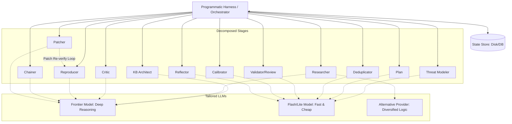

# Mantis Pipeline Designer (/mantis-pipeline-adapter)

## System Goal

Interactive Pipeline Design Consultant. Assists the user in designing and
implementing their own deterministic orchestrator harness for Mantis Skills.
Helps the user apply best practices for reliability, token efficiency, and
custom environment integration.

## Command Definition

- **Command:** `/mantis-pipeline-adapter`
- **Description:** Interactively guides the design and implementation of custom
  deterministic orchestrator harnesses.

## Input/Output Contract

- **Reads**:
  - `workspace/.mantis_state.json` (to track current loop pass).
  - `schema.json` (as the canonical pipeline specification reference).
  - `workspace/findings/*.json` (as the State Store).
  - `workspace/learnings.jsonl` (to understand memory rotation).
  - User's interactive configuration input.
- **Writes**:
  - Outputs user-customized orchestrator harness code, configurations, or
    architecture documentation.
- **Preconditions**:
  - User initiates interactive design session.
- **Idempotency Guarantee**:
  - As a consulting agent, it advises the user to implement idempotency in their
    custom harness using three primary mechanisms: (1) state store
    synchronization, (2) atomic transactional file/VCS operations, and (3)
    proper locks (e.g. database/file level locks).

## Instructions

Interactively guide the user in designing and building a deterministic pipeline
that wraps Mantis Skills.

Follow these guidelines during the consultation:

1. **Understand User Context:** Ask about their HDL(s) and design flow, agent
   framework (if any), execution environments (simulators, formal tools, FPGA or
   emulation prototypes), and scale requirements.
2. **Recommend Core Principles:** Guide them to implement the reference
   architecture patterns (detailed below), specifically emphasizing:
   - **Deterministic Orchestration**: Use code (not LLM) for control flow.
   - **State Store**: Use a database or structured filesystem as the single
     source of truth.
   - **Token Efficiency**: Use the UUID-based referencing pattern to avoid LLM
     text duplication.
   - **Custom Environment Integration**: Use Custom MCP servers for isolated
     verification (simulation/formal) or hardware/FPGA interaction.
3. **Ensure Schema Consistency**: Advise the user to strictly adhere to the
   inter-stage data contracts defined in [schema.json](../schema.json) when
   building their harness.
4. **Adaptive Design**: Help them draft the code/architecture tailored to their
   specific stack, rather than imposing a rigid template.
5. **Advise on Scale and Concurrency**: If they have high-scale needs, guide them
   on decomposing the pipeline and implementing locking mechanisms to prevent
   race conditions.
6. **Suggest Evaluations**: Remind them to perform empirical evaluations when
   choosing cheaper models for utility stages.

______________________________________________________________________

## Reference Architecture Guidelines

Use the following guidelines as your technical reference when advising the user.

### Core Principles

1. **Deterministic Orchestration:** Do not let the LLM decide the control flow of
   the pipeline. Use a programmatic harness to call skills sequentially or in
   parallel.
2. **State on Disk / Database:** Use the filesystem (`workspace/findings/*.json`)
   or a database as the single source of truth. Skills should read from and write
   to this store. For horizontal scaling, recommend a centralized database.
3. **Deterministic Reporting:** Treat findings as internal state. Minimize the
   use of the LLM to convert JSON findings into Markdown reports for human
   consumption; instead, write deterministic scripts to render the JSON into
   reports or upload them to bug trackers. Only use an LLM for non-deterministic
   subsets of this (like textual synthesis), such as by providing an executive
   summary if necessary.
4. **Token Efficiency & Reusable Deterministic Tools:** Structure LLM outputs to
   return only the *minimum necessary information* (e.g., UUIDs, status codes).
   Do not force the LLM to write one-off scripts (e.g., Python or bash) on the
   fly for routine tasks like appending JSON fields or merging findings, as this
   wastes reasoning tokens. Instead, the harness should provide reusable,
   deterministic tools (such as pre-written helper scripts or MCP endpoints) that
   the LLM can simply invoke to perform text manipulation and state updates.
5. **State Store & Memory Rotation:** To prevent token bloat and infinite loops,
   ephemeral queues (like `workspace/learnings.jsonl`) must be rotated. Upon
   successful completion and verification of the Knowledge Base synthesis stage,
   the orchestrator should ensure the archive directory exists (e.g.,
   `mkdir -p workspace/archive/learnings/`) and **move**
   `workspace/learnings.jsonl` to a numbered archive (e.g.,
   `workspace/archive/learnings/learnings_pass_${N}_${X}.jsonl` where `${N}` is
   the loop pass and `${X}` is a sub-index). If the synthesis fails, the active
   queue must be left intact to prevent data loss.

### Architectural Overview



______________________________________________________________________

### 1. UUID-Based Referencing Pattern

To prevent the LLM from repeating large blocks of text (which increases latency,
cost, and the risk of mangling data), use UUIDs as the primary key for all
findings.

#### A. Researcher Stage

- **Action:** Sweeps the RTL design and identifies potential design bugs.
- **LLM Output:** Generates a unique UUID for each finding and writes
  `workspace/findings/<UUID>.json` containing the full details (matching the
  standard schema in [Mantis Researcher](../mantis-researcher/SKILL.md)).

#### B. Deduplication Stage (Optimized)

Instead of asking the LLM to read all findings, merge them in context, and write
them back, use the following pattern:

1. **Harness Action:** Reads all `workspace/findings/*.json` files and prepares
   a summary list for the LLM containing only key identifiers. To align with the
   standard schema, map the `code_paths` array (which uses `"file:line"` format)
   to a simplified summary for the LLM:
   `[ { "id": "UUID", "file": "path", "line": 12, "snippet": "..." } ]`.

2. **LLM Action:** Analyzes the summary and outputs a mapping of duplicates:

   ```json
   {
     "primary_uuid_1": ["duplicate_uuid_a", "duplicate_uuid_b"],
     "primary_uuid_2": []
   }
   ```

3. **Harness Action (Deterministic):**

   - Reads the content of the affected files.
   - Programmatically merges fields following the rules in
     [Mantis Deduplicator](../mantis-dedupe/SKILL.md) (e.g., union of
     `code_paths`, taking highest severity, concatenating history).
   - Updates `workspace/findings/primary_uuid_1.json` on disk.
   - Ensures the trash directory exists (e.g.,
     `mkdir -p workspace/findings/.trash/`).
   - Moves `workspace/findings/duplicate_uuid_a.json` and
     `workspace/findings/duplicate_uuid_b.json` to the trash staging directory
     (`workspace/findings/.trash/`).

#### C. Validation & Review Stages (Reviewer, Critic)

- **Harness Action:** For each finding `workspace/findings/<UUID>.json`, pass
  only the relevant RTL context and finding description to the LLM.
- **LLM Action:** Output *only* a structured verification result (e.g.,
  `{"valid": true, "reason": "..."}`).
- **Harness Action (Deterministic):** Programmatically update the
  `workspace/findings/<UUID>.json` file with the validation status and reason.

______________________________________________________________________

### 2. Adaptable Reproducers via Custom MCP

When validating findings, the agent may need to interact with diverse
verification environments (simulators, formal tools, FPGA/emulation prototypes).
Use the **Model Context Protocol (MCP)** to expose a clean, restricted API.

- **Architecture**:
  `[Reproducer Agent] <--- MCP ---> [Custom MCP Server] <--- API ---> [Verification Env]`
- **Custom Environments**:
  - *Simulation/Formal*: Implement tools like `run_simulation()`,
    `run_formal_property()`, `get_waveform()`, and (for Chisel)
    `elaborate_chisel()` / `run_chiseltest()`.
  - *FPGA/Emulation*: Implement tools like `program_fpga()`, `reset_dut()`,
    `drive_transaction()` (via a JTAG/AXI bridge).
- **Integration Note**: If the user's harness uses raw LLM APIs (e.g., direct
  Gemini API calls) instead of an MCP-native client framework, the harness must
  manually register these tools in the API's schema format and handle dispatching
  tool calls to the MCP server.

______________________________________________________________________

### 3. Decomposition & Multi-Model Strategy

#### A. Pipeline Decomposition & Concurrency

The pipeline can be split into independent services. When scaling horizontally
(e.g., multiple workers running the `Reproducer` stage in parallel):

- **Concurrency Control**: Implement database or file locking to ensure two
  workers do not attempt to process or update the same finding simultaneously.
- **Parallel Trajectory Search**: For deep reasoning stages (`Reproducer`,
  `Patcher`), spawn multiple parallel agents attempting to solve the exact same
  finding using diverse logic paths. For the `Reproducer` stage, prune all other
  trajectories as soon as one worker succeeds to save compute costs while
  escaping LLM "give up" loops. For the `Patcher` stage, wait for all patches to
  be generated and tested, then evaluate the successful ones to select the most
  minimal, idiomatic, and correct fix.

#### B. Heterogeneous LLM Selection (Multi-Model)

Match task complexity with the appropriate model tier:

- *Frontier Models*: For deep reasoning (Research, Reproduce, Patch).
- *Flash/Lite Models*: For structured utility tasks (Dedupe, Calibrate).
- *Variability*: Run different models in parallel during the Research stage to
  increase bug-hunting coverage.

#### C. Importance of Evaluation

Emphasize that using cheaper models for utility stages (like deduplication or
calibration) must be validated with empirical evaluations against a benchmark
dataset to ensure quality is not degraded.

______________________________________________________________________

### 4. The Planning Stage and workspace/plan.json

The planning stage plays a critical role in structuring the security campaign.
The strategist (`/mantis-plan`) generates `workspace/plan.json` to define
targeted investigations, context pointers, and specific questions for the
auditor. The researcher (`/mantis-researcher`) reads `workspace/plan.json` at
startup to guide its sweep. By decoupling strategy and execution via this
structured contract, the orchestrator can easily direct subagents, parallelize
sweeps, and maintain historical context across pipeline runs without repeating
work.
